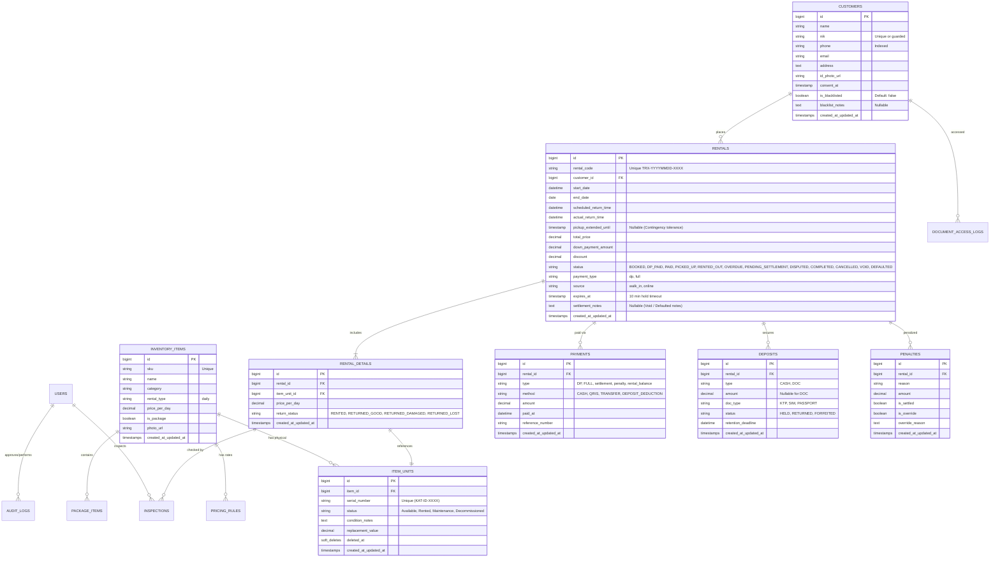

# SummitGear — Database Architecture & ERD Blueprint

Dokumentasi skema basis data PostgreSQL / SQLite untuk aplikasi SummitGear Rental & POS.

---

## 📊 Entity Relationship Diagram (Mermaid)

---

## 🛡️ Database Constraints & Business Invariants

1. **Anti-Hoarding Exclusion**:
   - Transaksi online yang belum dibayar mengunci unit dengan status `PENDING_PAYMENT` dan batas kadaluwarsa `expires_at` maksimal 10 menit.
2. **Exclusion Check on Unit Deletion**:
   - Unit fisik (`item_units`) tidak boleh dihapus jika masih terikat pada `rental_details` dengan status sewa aktif/terjadwal (`NOT IN ('COMPLETED', 'CANCELLED', 'VOID')`).
3. **Pessimistic Locking (`lockForUpdate`)**:
   - Seluruh alur checkout publik dan kasir mengunci baris unit terkait di database untuk menjamin integritas data (ACID) dan mencegah race condition.
4. **Deposit Settlement Balance**:
   - Pelunasan denda/kekurangan sewa dari deposit cash secara otomatis menciptakan record pembayaran `type = 'penalty', method = 'DEPOSIT_DEDUCTION'`, memastikan neraca keuangan toko selalu seimbang.
