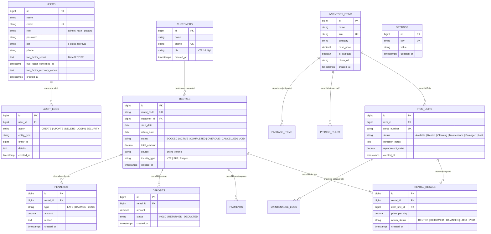
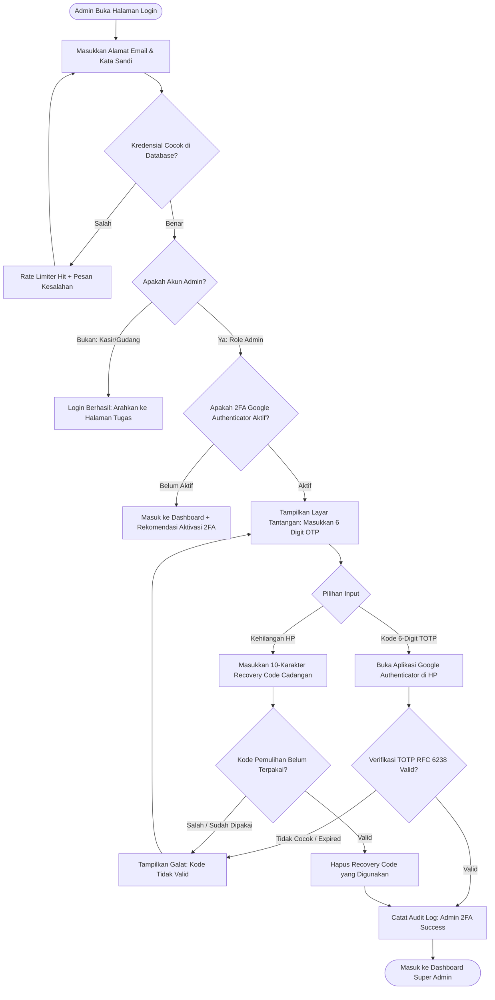
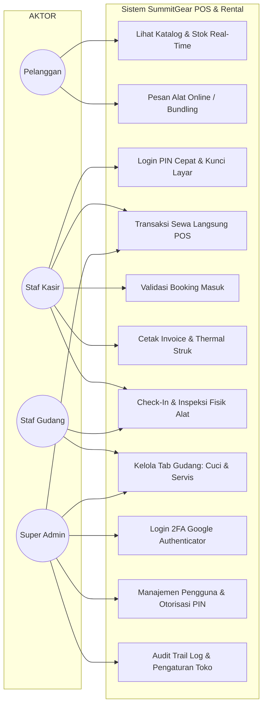

# Dokumentasi Diagram & Panduan Sistem SummitGear

Dokumen ini memuat seluruh diagram arsitektur teknis, alur proses bisnis (*flowchart*), diagram entitas data (*ERD*), *Use Case*, serta panduan ringkas penggunaan sistem **SummitGear POS & Outdoor Rental System**.

---

## 1. Entity Relationship Diagram (ERD)

Diagram relasi antar-entitas database PostgreSQL / Laravel Eloquent yang digunakan pada sistem SummitGear:

---

## 2. Flowchart Alur Bisnis End-to-End (Rental Cycle)

Alur operasional mulai dari pelanggan, pelayanan kasir, serah terima, hingga pemeriksaan pengembalian di gudang:

```mermaid
flowchart TD
    Start([Mulai: Pelanggan Butuh Alat]) --> Choice{Pilih Jalur Akses}
    
    %% Jalur Online Booking
    Choice -->|Online Booking| WebKatalog[Buka Landing Page / Katalog Real-Time]
    WebKatalog --> SelectDates[Pilih Tanggal Sewa & Durasi]
    SelectDates --> AddCart[Pilih Peralatan / Paket Hemat]
    AddCart --> InputCustomer[Isi Data Diri & No. WhatsApp]
    InputCustomer --> SubmitBooking[Kirim Booking: Status BOOKED]
    SubmitBooking --> HoldTimer[Sistem Kunci Stok Unit: Toleransi 2 Jam]
    HoldTimer --> ArriveStore[Pelanggan Datang ke Outlet Toko]
    
    %% Jalur Walk-in Langsung
    Choice -->|Datang Langsung / Walk-In| DirectStore[Datang Langsung ke Toko]
    DirectStore --> KasirScreen[Kasir Buka POS Kasir]
    
    %% Temu di Kasir
    ArriveStore --> KasirScreen
    KasirScreen --> VerifyUnit[Kasir & Pelanggan Cek Fisik Peralatan / QC]
    VerifyUnit --> PricingEngine[Sistem Kalkulasi Tarif Otomatis: Weekday / Weekend]
    PricingEngine --> SetDeposit[Tetapkan Uang Jaminan / Deposit & Titip KTP]
    SetDeposit --> PayInvoice[Pembayaran & Cetak Invoice Struk]
    PayInvoice --> CheckOut[Serah Terima Barang: Status Rental ACTIVE]
    
    %% Masa Pendakian
    CheckOut --> Hiking[Pendakian Gunung / Pemakaian Alat]
    Hiking --> ReturnOutlet[Kembali ke Outlet Meja Pengembalian]
    
    %% Pemeriksaan Pengembalian
    ReturnOutlet --> CheckIn[Staf Lakukan Check-In & Inspeksi Fisik]
    CheckIn --> IsOverdue{Terlambat Kembali?}
    IsOverdue -->|Ya| CalcLateFee[Hitung Denda Otomatis per Jam]
    IsOverdue -->|Tidak| CheckDamage{Ada Kerusakan / Hilang?}
    CalcLateFee --> CheckDamage
    
    CheckDamage -->|Ada Kerusakan| DeductDeposit[Potong Biaya dari Deposit]
    CheckDamage -->|Kondisi Baik & Lengkap| RefundDeposit[Kembalikan Uang Deposit 100%]
    DeductDeposit --> MoveToGudang[Unit Masuk Antrian Gudang: Cleaning / Maintenance]
    RefundDeposit --> MoveToGudang
    
    MoveToGudang --> WarehouseQC[Staf Gudang Cuci / Servis Alat]
    WarehouseQC --> ReadyStock[Unit Bersih & Siap Sewa: Status Available]
    ReadyStock --> Selesai([Selesai: Transaksi COMPLETED])
```

---

## 3. Flowchart Keamanan Login Administrator (Google Authenticator 2FA)

Alur verifikasi login Administrator yang menjamin keamanan berlapis:

---

## 4. Use Case Diagram

Interaksi antara 4 aktor sistem SummitGear:

---

## 5. Panduan Penggunaan & Kredensial Demo Cepat

### Kredensial Pengguna Bawaan (Default Demo Accounts)
| Peran (Role) | Email Login | Kata Sandi | PIN Cepat | Halaman Awal |
| :--- | :--- | :--- | :--- | :--- |
| **Super Admin** | `admin@summitgear.com` | `password123` | `123456` | `/dashboard` |
| **Kasir Utama** | `kasir@summitgear.com` | `password123` | `111111` | `/admin/transactions/create` |
| **Staf Gudang** | `gudang@summitgear.com` | `password123` | `222222` | `/admin/maintenance/kanban` |

### Langkah Aktivasi 2FA Google Authenticator
1. Login sebagai Admin di `http://localhost:8000/login`.
2. Buka menu **Pengaturan** di sidebar navigasi.
3. Gulir ke bagian **Keamanan 2FA (Google Authenticator)**.
4. Klik tombol **Aktifkan Google Authenticator (2FA)**.
5. Pindai kode QR yang muncul menggunakan aplikasi Google Authenticator di ponsel Anda (atau masukkan kunci rahasia manual).
6. Masukkan 6 digit angka yang tampil di ponsel Anda, lalu klik **Konfirmasi & Aktifkan 2FA**.
7. Salin/simpan 8 kode pemulihan cadangan (*Recovery Codes*). Selesai!
